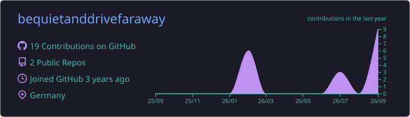
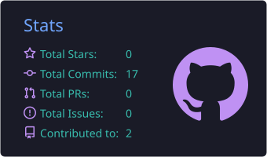
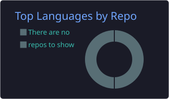

<p align="center">
  <a href="https://discord.com/users/YOUR_DISCORD_ID#gh-light-mode-only">
    
  </a>
  <a href="https://discord.com/users/YOUR_DISCORD_ID#gh-dark-mode-only">
    
  </a>
</p>

---

<h1 align="left">Hallo, I'm Ant</h1>

###


<p align="left"><a href="https://git.io/typing-svg"></a></p>

###

<div align="left">
  
</div>

###

```py
class Ant:
    def __init__(self):
        self.role = 'Backend dev'
        self.languages = ['python', 'typescript', 'javascript', 'c', 'c++']
        self.interests = ['backend', 'discord bots', 'roblox', 'tooling']
        self.environment = {
            'editor': 'VSCode',
        }
        self.music = 'Spotify'
```

###

<h2 align="center">💻 Skills</h2>

<p align="center">
  <a href="https://skillicons.dev">
    
  </a>
</p>

###

<p align="center">
  
</p>
<p align="center">
  
  
</p>

---


